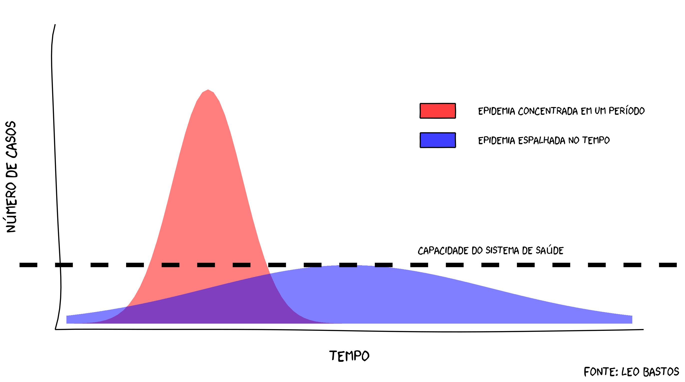

# COVID-19

In this project I intent to analyse the COVID-19 data provided by the Johns Hopkins University Center for Systems Science and Engineering (JHU CSSE) focusing on South America, in particular in Brazil.

I also prepared a version of "flatten the curve" in Portuguese using for sharing in social media. Fell free to use it and adapt it, the code for it is available at [here](https://github.com/lsbastos/COVID-19/blob/master/R/flatten_curve.R).

